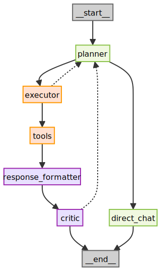

# GraphRAG Agent with Self-Reflection

🚀 Build a Graph-Powered LangGraph Agent

An AI agent that implements **GraphRAG** with **Self-RAG** (Self-Reflection Agent) using Microsoft [GraphRAG](https://github.com/microsoft/graphrag) for enhanced fact verification and reduced hallucinations.

## 🎯 Features

- **GraphRAG Implementation**: Microsoft GraphRAG with entity extraction and community detection
- **Self-Reflection Agent**: Self-RAG architecture with automatic fact verification and response refinement
- **LangGraph Workflow**: State machine with automatic retry logic for low-confidence responses  
- **MCP Tool Support**: Extensible tool system following Model Context Protocol patterns
- **Production Ready**: Full error handling, logging, and async support

## 🏗️ Architecture
<div align="center">

</div>

### Workflow Steps

1. **Planner**: Classifies queries and routes them appropriately
2. **Executor**: Automatically selects and calls appropriate tools (local_search, global_search, weather)
3. **Response Formatter**: Formats tool outputs into natural language responses
4. **Self-Reflection Critic**: Evaluates output for fact verification and consistency using GraphRAG
5. **Decision**: Retry with new plan if self-reflection identifies issues, otherwise return response

## 🤖 What is Graph RAG?

Graph RAG (Retrieval-Augmented Generation on a Knowledge Graph) is an advanced technique that enhances Large Language Models (LLMs) by grounding them in a structured knowledge base. Unlike traditional RAG which retrieves from unstructured text, Graph RAG builds a **knowledge graph** from the source data.

This allows the agent to:
- **Reason over relationships**: Understand connections between entities (e.g., people, places, concepts).
- **Reduce hallucinations**: Verify facts against the structured graph before generating a response.
- **Provide context-rich answers**: Synthesize information from multiple connected sources for more comprehensive replies.

This agent uses Microsoft's GraphRAG engine to automatically extract entities and relationships from your documents and build a robust knowledge graph. The self-reflection component then uses this graph to verify and refine responses, as shown below:

<div align="center">

</div>

## 🚀 Quick Start

### 1. Installation

```bash
git clone <your-repo>
cd graphrag-agent
pip install -r requirements.txt
```

### 2. Configuration

```bash
cp .env.example .env
# Edit .env with your API keys:
# OPENAI_API_KEY=your_openai_key_here
# WEATHER_API_KEY=your_weather_key_here (optional)
```

### 3. Initialize Knowledge Base

```bash
# Setup vector store and knowledge graph
python main.py setup
```

### 4. Run Demo

```bash
# Interactive mode
python main.py interactive

# Pre-built demo queries
python main.py demo

# Async processing demo
python main.py async
```

## 📊 Self-Reflection & Fact Verification

The agent uses a self-reflection mechanism to verify and improve responses:

### GraphRAG-Based Self-Reflection
- Agent reflects on its own responses using the GraphRAG knowledge graph
- Verifies facts and entity relationships against structured knowledge
- Cross-references generated content with community structures and hierarchical summaries

### Automatic Response Refinement
- Self-reflection identifies potential issues or inaccuracies
- Agent automatically refines responses based on graph verification
- Iterative improvement until self-reflection is satisfied

### Retry Logic
- Self-reflection triggers retry when issues are detected
- Maximum retry limit to prevent infinite loops
- Final responses include confidence indicators based on self-reflection

## 🛠️ Usage Examples

### Basic Query
```python
from src.agents.graph_agent import create_agent

agent = create_agent()
result = agent.run("What are the main countries in Europe?")

print(result["response"])
```

### Available Tools
The agent automatically selects the appropriate search strategy:

```python
# Local search: Entity-focused, detailed responses
agent.run("Tell me about Estonia's cultural connections")

# Global search: High-level summaries across knowledge base  
agent.run("What are the main themes in European politics?")

# Weather tool: Current conditions
agent.run("What's the weather like in Helsinki today?")
```

### Async Processing
```python
import asyncio

async def main():
    agent = create_agent()
    result = await agent.arun("Tell me about Finnish culture")
    return result

result = asyncio.run(main())
```

### Adding Custom Tools
```python
from src.tools.weather_tool import WeatherTool

weather_tool = WeatherTool()
result = weather_tool.get_weather("Helsinki")
```

## 📁 Project Structure

```
ai-agent-yt-01/
├── src/
│   ├── agents/
│   │   ├── graph_agent.py      # Main LangGraph agent
│   │   └── nodes.py            # Individual workflow nodes
│   ├── knowledge/
│   │   ├── graph_builder.py    # Knowledge graph construction
│   │   ├── graph_retrieval.py  # Graph-based retrieval
│   │   └── vector_store_builder.py # Vector store setup
│   ├── evaluation/
│   │   └── verification.py     # Fact verification
│   ├── tools/
│   │   ├── retrieval_tool.py   # Search tools
│   │   └── weather_tool.py     # Weather API tool
│   └── utils/
│       ├── config.py           # Configuration management
│       ├── parsers.py          # Text processing utilities
│       └── simple_viz.py       # Visualization helpers
├── data/                       # Knowledge base and outputs
├── graphrag/                   # GraphRAG cache and processing
├── tests/                      # Unit tests
└── main.py                     # Main entry point
```
